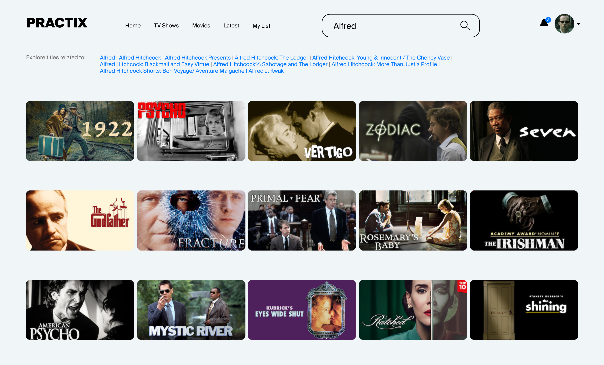

# Проектная работа 4 спринта

## Порядок запуска проекта
1. Для запуска проекта требуется заполненная база ElasticSearch. Для переноса данных из Postgresql используется другой репозиторий:
https://github.com/ADesBiysk/new_admin_panel_sprint_3
После клонирования репозитория следуйте инструкциям в файле README.md

2. Для запуска данного проекта:

docker-compose up -d --build

3. URL для запуска: http://0.0.0.0/api/openapi

Если нужно создать индексы и заполнить фейковыми данными, то после запуска ElasticSearch:
1. docker-compose exec app /bin/bash
2. /utils/create_indexes.sh
3. /utils/fill_movies.py

## Code review 2022.06.20
1. В продакшене не рекомендуется запускать код через uvicorn напрямую, вот тут про это написано несколько слов https://www.uvicorn.org/deployment/#gunicorn.**
2. Документация ваших сервисов выглядит максимально куцей, давайте добавим хотя бы description, подробнее тут: https://fastapi.tiangolo.com/tutorial/path-operation-configuration/?h=description#summary-and-description**
3. Конфиг fast_api/src/core/config.py можно было оформить в виде класса:
```
from pydantic import BaseSettings

class Settings(BaseSettings):
    REDIS_HOST: str = os.getenv('REDIS_HOST', '127.0.0.1') 
    class Config:
        env_file = '.env'

settings = Settings()
```
и затем использовать инстанс конфига setting в разных частях приложения. Плюс такого подхода в том, что происходит валидация типов переменных окружения при помощи pydantic. Также при создании инфраструктуры под тесты, можно будет наследоваться от этого класса и создать отдельный тестовый конфиг со своими переменными окружения. Подробнее https://pydantic-docs.helpmanual.io/usage/settings/
 
4. В моделях необходим рефакторинг, можно избавиться от дублирования кода, попробуйте наследовать модели от:
```
class BaseOrjsonModel(BaseModel): 
      class Config: 
            json_loads = orjson.loads 
            json_dumps = orjson_dumps
```
5. Вот это и это (и далее в src/api/v1/genres.py и src/api/v1/persons.py) тоже модели и к ним относятся все те же рекомендации: держать их в models.py или в другом специальном файле response_models.py и использовать orjson, а с учетом п.4 - наследоваться от BaseOrjsonModel
6. При использовании Redis рекомендуется использовать структурированный ключ из которого понятно, что лежит по этому ключу <es_index>::<first_key>::<first_value>::<second_key>::<second_value>, :: в ключе просто для примера - separate symbol может в принципе быть любой.
Это важно по следующим причинам:
* Иногда все таки приходится забегать в редис и смотреть что там лежит. 
* Фильтрация по паттерну
7. Этот сервис выдачи контента, как и остальные сервисы кинотеатра, доступные пользователю, должен отдаваться через nginx.**
8. Текстовые сообщения, отдаваемые пользователю, (No films found based on your request, The film is not found) у вас расположены в разных местах кода, если появится задача добавить информативности или изменить текст сообщения, или встанет вопрос про мультиязычность, то придется по всему проекту выискивать и менять. Будет проще справиться с этой задачей, если такие сообщения будут вынесены в отдельное место в виде констант (например).
9. Из кода нужно убрать print, его вывода мы не сможем увидеть на удаленном сервере.
10. Попробуйте https://pypi.org/project/oitnb/. Можно одной командой oitnb -l120 src/api/v1 привести код в соответствие с pep8 и просто красиво отформатировать.**

## Техническое задание на второй модуль

Ваш второй проект — асинхронный API для кинотеатра. Этот сервис будет точкой входа для всех клиентов. В первой итерации в сервисе будут только анонимные пользователи. Функции авторизации и аутентификации запланированы в модуле Auth.

### Задачи
0. Создать репозиторий, дать в него доступы (1 б.)

Создать репозиторий для проекта на основе шаблона, расшарить доступы для тиммейтов и кодревьюеров

Каждый микросервис реализуется и работает как полностью независимая система, предоставляющая доступ к своей внутренней логике и данным с помощью определенного интерфейса. Это способствует повышению гибкости ПО, поскольку каждый микросервис является независимой единицей в плане разработки и масштабирования.

Будучи независимыми сервисами с четкими границами, не копируйте admin и etl в новый репозиторий.

1. Создать базовую структуру приложения (3 б.)

Создать базовые файлы и папки по уроку FastAPI, включить туда requirements.txt.

2. Настроить докерфайл и докеркомпоуз (5 б.)

Нужен Dockerfile для билда бекенда для API. Также нужно создать (или адаптировать созданные ранее) docker-compose, чтобы поднимались все сервисы разом.

**Будет 3 контейнера: app, es, redis.**

3. Создать модели для фильмов и связанных данных (5 б.)

Создать модели, прописав правильные типы данных для:
* фильмов, **сериалов**.
* жанров,
* актеров, сценаристов, режиссеров.

+ Фильм — заголовок, содержание, дата создания, **возрастной ценз**, режиссёры, актёры, сценаристы, жанры, **ссылка на файл**.
+ Сериал — заголовок, содержание, даты создания, режиссёры, актёры, сценаристы, жанры, **ссылка на файл**.
+ Актёр — **имя**, **фамилия**, фильмы с его участием.
+ Режиссёр — **имя**, **фамилия**, фильмы, которые он снял.
+ Сценарист — **имя**, **фамилия**, фильмы по его сценариям.
+ Жанр — описание, **популярность**.

4. Написать сервис для получения информации о фильмах (13 б.)

Добавить сервис, который обращается к Elasticsearch (используя драйвер) и возвращает информацию о фильмах – по одному или списком.

При запросе списком учитывать параметры фильтрации и сортировки.

5. Доработать ETL для записи в ES данных жанров (5 б.)

Добавить новый ETL пайплайн, в котором создается и заполняется индекс genres из всех жанров, которые есть в фильмах. Плоский индекс без денормализованных данных. Хранить ссылки на фильмы не нужно.

6. Доработать ETL для записи в ES данных персоналий (5 б.)

Добавить новый ETL пайплайн, в котором создается и заполняется индекс persons из всех людей, которые есть в фильмах. Плоский индекс без денормализованных данных. Хранить роли и ссылки на фильмы не нужно.

7. Написать сервисы для получения информации об персоналиях и жанрах (13 б.)

Добавить сервис, который обращается к Elasticsearch и возвращает информацию о персоналиях и жанрах - по одному или списком.

При запросе списком учитывать параметры фильтрации и сортировки.

8. Кеширование данных в Redis (8 б.)

Кешировать ответы ручек, запрошенных с одинаковыми параметрами, чтобы не ходить лишний раз в Elasticsearch.


### Используемые технологии

+ Код приложения пишется на Python + FastAPI.
+ Приложение запускается под управлением сервера ASGI (uvicorn).
+ В качестве хранилища используется ElasticSearch (**контейнер №1**).
+ Для кеширования данных понадобится Redis Cluster (**контейнер №2**).
+ Все компоненты системы запускаются через Docker (**контейнер №3**).

### Основные сущности (_ES_)

1. Фильм — заголовок, содержание, ~~дата создания~~, ~~**возрастной ценз**~~, режиссёры, актёры, сценаристы, жанры, ~~ссылка на файл~~.
* "uuid": "uuid",
* "title": "str",
* "imdb_rating": "float",
* "description": "str",
* "genre": [ {"uuid": "uuid", "name": "str"}, ...]
* "actors": [ {"uuid": "uuid", "full_name": "str"}, ...]
* "writers": [ {"uuid": "uuid", "full_name": "str"}, ...]
* "directors": [ {"uuid": "uuid", "full_name": "str"}, ...]


+ Сериал — заголовок, содержание, даты создания, режиссёры, актёры, сценаристы, жанры, **ссылка на файл**.
+ Актёр — **имя**, **фамилия**, фильмы с его участием.
+ Режиссёр — **имя**, **фамилия**, фильмы, которые он снял.
+ Сценарист — **имя**, **фамилия**, фильмы по его сценариям.
+ Жанр — описание, **популярность**.

### Экраны в клиентском приложении

Главная страница


Поиск


Страница фильма


Страница персонажа


Страница жанра


Соответствие экранов и эндпоинтов
#### 1. Главная страница
На ней выводятся популярные фильмы. Пока у вас есть только один признак, который можно использовать в качестве критерия популярности — imdb_rating.

```
/api/v1/films?sort=-imdb_rating
  http request
  GET /api/v1/films?sort=-imdb_rating&page[size]=50&page[number]=1
  [

  {
    "uuid": "uuid",
    "title": "str",
    "imdb_rating": "float"
  },
  ...
  ]

  [
  {
    "uuid": "524e4331-e14b-24d3-a156-426614174003",
    "title": "Ringo Rocket Star and His Song for Yuri Gagarin",
    "imdb_rating": 9.4
  },
  {
    "uuid": "524e4331-e14b-24d3-a156-426614174003",
    "title": "Lunar: The Silver Star",
    "imdb_rating": 9.2
  },
  ...
  ]
```

Жанр и популярные фильмы в нём. Это просто фильтрация.

```
/api/v1/films?sort=-imdb_rating&filter[genre]=<comedy-uuid>
http request
GET /api/v1/films?filter[genre]=<uuid:UUID>&sort=-imdb_rating&page[size]=50&page[number]=1
[
{
  "uuid": "uuid",
  "title": "str",
  "imdb_rating": "float"
},
...
]

[
{
  "uuid": "524e4331-e14b-24d3-a156-426614174003",
  "title": "Ringo Rocket Star and His Song for Yuri Gagarin",
  "imdb_rating": 9.4
},
{
  "uuid": "524e4331-e14b-24d3-a156-426614174003",
  "title": "Lunar: The Silver Star",
  "imdb_rating": 9.2
},
...
]
```

Список жанров.

```
/api/v1/genres/
http request
GET /api/v1/genres/
[
{
  "uuid": "uuid",
  "name": "str",
  ...
},
...
]

[
{
  "uuid": "d007f2f8-4d45-4902-8ee0-067bae469161",
  "name": "Adventure",
  ...
},
{
  "uuid": "dc07f2f8-4d45-4902-8ee0-067bae469164",
  "name": "Fantasy",
  ...
},
...
]
``` 

Онлайн-кинотеатру выгодно показывать как можно больше разных фильмов. Они не должны повторяться между блоком «популярное» и блоком конкретного жанра. Причём внутри списка «популярных» фильмов важно, чтобы в нём были представители разных жанров — так получится покрыть все возможные интересы пользователя при первом заходе. Подумайте об этом, хоть это и вне скоупа.
#### 2. Поиск
Поиск по фильмам.

```
/api/v1/films/search/
  http request
GET /api/v1/films/search?query=captain&page[number]=1&page[size]=50
[
{
  "uuid": "uuid",
  "title": "str",
  "imdb_rating": "float"
},
...
]

[
{
  "uuid": "223e4317-e89b-22d3-f3b6-426614174000",
  "title": "Billion Star Hotel",
  "imdb_rating": 6.1
},
{
  "uuid": "524e4331-e14b-24d3-a456-426614174001",
  "title": "Wishes on a Falling Star",
  "imdb_rating": 8.5
},
...
] 
```

Поиск по персонам.
```
/api/v1/persons/search/
http request
GET /api/v1/persons/search?query=captain&page[number]=1&page[size]=50
[
{
  "uuid": "uuid",
  "full_name": "str",
  "role": "str",
  "film_ids": ["uuid"]
},
...
]
[
  {
    "uuid": "724e5631-e14b-14e3-g556-888814284902",
    "full_name": "Captain Raju",
    "role": "actor",
    "film_ids": ["eb055946-4841-4b83-9c32-14bb1bde5de4", ...]
 },
] 
```

#### 3. Страница фильма
Полная информация по фильму.

```
/api/v1/films/<uuid:UUID>/
  http request
GET /api/v1/films/<uuid:UUID>/
{
"uuid": "uuid",
"title": "str",
"imdb_rating": "float",
"description": "str",
"genre": [
  { "uuid": "uuid", "name": "str" },
  ...
],
"actors": [
  {
    "uuid": "uuid",
    "full_name": "str"
  },
  ...
],
"writers": [
  {
    "uuid": "uuid",
    "full_name": "str"
  },
  ...
],
"directors": [
  {
    "uuid": "uuid",
    "full_name": "str"
  },
  ...
],
}

{
"uuid": "b31592e5-673d-46dc-a561-9446438aea0f",
"title": "Lunar: The Silver Star",
"imdb_rating": 9.2,
"description": "From the village of Burg, a teenager named Alex sets out to become the fabled guardian of the goddess Althena...the Dragonmaster. Along with his girlfriend Luna, and several friends they meet along the journey, they soon discover that the happy world of Lunar is on the verge of Armageddon. As Dragonmaster, Alex could save it. As a ruthless and powerful sorceror is about to play his hand, will Alex and company succeed in their quest before all is lost? And is his girlfriend Luna involved in these world shattering events? Play along and find out.",
"genre": [
  {"name": "Action", "uuid": "6f822a92-7b51-4753-8d00-ecfedf98a937"},
  {"name": "Adventure", "uuid": "00f74939-18b1-42e4-b541-b52f667d50d9"},
  {"name": "Comedy", "uuid": "7ac3cb3b-972d-4004-9e42-ff147ede7463"}
],
"actors": [
  {
    "uuid": "afbdbaca-04e2-44ca-8bef-da1ae4d84cdf",
    "full_name": "Ashley Parker Angel"
  },
  {
    "uuid": "3c08931f-6138-46d1-b179-1bd076b6a236",
    "full_name": "Rhonda Gibson"
  },
  ...
],
"writers": [
  {
    "uuid": "1bd9a00b-9596-49a3-afbe-f39a632a09a9",
    "full_name": "Toshio Akashi"
  },
  {
    "uuid": "27fc3dc6-2656-43cb-8e56-d0dfb75ea0b2",
    "full_name": "Takashi Hino"
  },
  ...
],
"directors": [
  {
    "uuid": "4a893a97-e713-4936-9dd4-c8ca437ab483",
    "full_name": "Toshio Akashi"
  },
  ...
],
} 
```

Похожие фильмы. Похожесть можно оценить с помощью ElasticSearch, но цель модуля не в этом. Сделаем просто: покажем фильмы того же жанра.
```
/api/v1/films?...
```

#### 5. Страница персонажа
Данные по персоне.
```
/api/v1/persons/<uuid:UUID>/
  http request
GET /api/v1/persons/<uuid:UUID>
{
"uuid": "uuid",
"full_name": "str",
"role": "str",
"film_ids": ["uuid"]
}

{
"uuid": "524e4331-e14b-24d3-a456-426614174002",
"full_name": "George Lucas",
"role": "writer",
"film_ids": ["uuid", ...]
} 
```

Фильмы по персоне.
```
/api/v1/persons/<uuid:UUID>/film/
http request
!DEPRECATED - used for old android devices

GET /api/v1/persons/<uuid:UUID>/film
[
{
  "uuid": "uuid",
  "title": "str",
  "imdb_rating": "float"
},
...
]

[
{
  "uuid": "524e4331-e14b-24d3-a456-426614174001",
  "title": "Star Wars: Episode VI - Return of the Jedi",
  "imdb_rating": 8.3
},
{
  "uuid": "123e4317-e89b-22d3-f3b6-426614174001",
  "title": "Star Wars: Episode VII - The Force Awakens",
  "imdb_rating": 7.9
},
...
] 
```

#### 5. Страница жанра
Данные по конкретному жанру.

```
`/api/v1/genres/<uuid:UUID>/
http request
GET /api/v1/genres/<uuid:UUID>
{
"uuid": "uuid",
"name": "str",
...
}

{
"uuid": "aabbd3f3-f656-4fea-9146-63f285edf5с1",
"name": "Action",
...
} 
```

Популярные фильмы в жанре.
```
/api/v1/films...
```

## Структура проекта

+ src — содержит исходный код приложения.
+ main.py — входная точка приложения.
+ api — модуль, в котором реализуется API. Другими словами, это модуль для предоставления http-интерфейса клиентским приложениям. Внутри модуля отсутствует какая-либо бизнес-логика, так как она не должна быть завязана на HTTP.
+ core — содержит разные конфигурационные файлы.
+ db — предоставляет объекты баз данных (Redis, Elasticsearch) и провайдеры для внедрения зависимостей. Redis будет использоваться для кеширования, чтобы не нагружать лишний раз Elasticsearch.
+ models — содержит классы, описывающие бизнес-сущности, например, фильмы, жанры, актёров.
+ services — главное в сервисе. В этом модуле находится реализация всей бизнес-логики. Таким образом она отделена от транспорта. Благодаря такому разделению, вам будет легче добавлять новые типы транспортов в сервис. Например, легко добавить RPC протокол поверх AMQP или Websockets.

## Важное сообщение для тимлида:
для ускорения проверки проекта укажите ссылку на приватный репозиторий с командной работой в файле readme и отправьте свежее приглашение на аккаунт [BlueDeep](https://github.com/BigDeepBlue).

В папке **tasks** ваша команда найдёт задачи, которые необходимо выполнить в первом спринте второго модуля.  Обратите внимание на задачи **00_create_repo** и **01_create_basis**. Они расцениваются как блокирующие для командной работы, поэтому их необходимо выполнить как можно раньше.

Мы оценили задачи в стори поинтах, значения которых брались из [последовательности Фибоначчи](https://ru.wikipedia.org/wiki/Числа_Фибоначчи) (1,2,3,5,8,…).

Вы можете разбить имеющиеся задачи на более маленькие, например, распределять между участниками команды не большие куски задания, а маленькие подзадачи. В таком случае не забудьте зафиксировать изменения в issues в репозитории.

**От каждого разработчика ожидается выполнение минимум 40% от общего числа стори поинтов в спринте.**


## Требования к проекту
+ Структура API должна быть понятна пользователям и задокументирована.
+ Код проекта должен быть аккуратным и без дублирования.
+ Время ответа сервиса не превышает 200 мс.
+ В сервисе решена проблема 10к соединений.
+ Требования к объёму данных
+ 200 000+ фильмов.
+ 200 000+ сериалов.
+ 100+ жанров.

